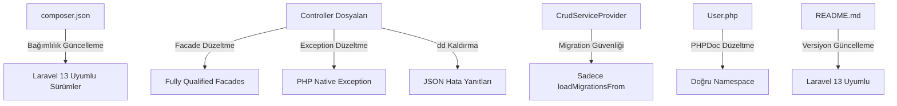

# Tasarım Dokümanı: Laravel 13 Yükseltme

## Genel Bakış

Bu tasarım dokümanı, `zaurac/crud` Laravel CRUD paketinin Laravel 13 ile uyumlu hale getirilmesi için gereken tüm teknik değişiklikleri tanımlar. Yükseltme kapsamı; Composer bağımlılık güncellemeleri, deprecated Facade alias'larının düzeltilmesi, hatalı Exception sınıfı referanslarının temizlenmesi, Service Provider güvenliği, debug ifadelerinin kaldırılması, PHPDoc düzeltmeleri, MediaController düzeltmesi ve README güncellemesini içerir.

### Araştırma Bulguları

Kod tabanı analizi sonucunda tespit edilen sorunlar:

**Facade Alias Kullanımları (9 dosya):**
- `use Session;` → 7 dosyada (AuthController, CrudController, ModuleController, MenuController, RoleGroupController, UserController, MainController)
- `use Validator;` → 9 dosyada (yukarıdakilere ek olarak MediaController, SettingController)

**Mockery\Exception Kullanımları (6 dosya):**
- CrudController, ModuleController, MenuController, RoleGroupController, UserController, MainController

**dd() Kullanımları (4 nokta):**
- AuthController: 2 adet (index ve forgotSend catch blokları)
- ModuleController: 2 adet (destroy ve realtime metotları)

**MediaController Özel Durumu:**
- `use Validator;` global alias kullanıyor
- `catch (Exception $e)` kullanıyor ancak hiçbir Exception sınıfı import edilmemiş — tanımsız sınıf referansı
- `App\Http\Controllers\Controller` extend ediyor, `crudPackage\Http\Controllers\Controller` yerine

---

## Mimari

Yükseltme işlemi mevcut mimariyi değiştirmez. Tüm değişiklikler mevcut dosyalar üzerinde yapılacak düzeltmelerdir:



### Değişiklik Stratejisi

Tüm değişiklikler dosya bazında `strReplace` ile yapılacaktır. Hiçbir dosya sıfırdan yazılmayacak, mevcut kod korunacaktır.

---

## Bileşenler ve Arayüzler

### 1. Composer Manifest (composer.json)

**Mevcut Durum:**
```json
{
  "require": {
    "yajra/laravel-datatables-oracle": "*",
    "intervention/image": "*",
    "spatie/laravel-activitylog": "*"
  }
}
```

**Hedef Durum:**
```json
{
  "require": {
    "php": "^8.3",
    "illuminate/support": "^12.0|^13.0",
    "yajra/laravel-datatables-oracle": "^11.0|^12.0",
    "intervention/image": "^3.0",
    "spatie/laravel-activitylog": "^4.0"
  }
}
```

**Gerekçe:** Wildcard bağımlılıklar, uyumsuz major sürümlerin yüklenmesine neden olabilir. Sabit sürüm aralıkları ile Laravel 13 uyumluluğu garanti altına alınır.

### 2. Facade Alias Düzeltmeleri

Etkilenen dosyalar ve değişiklikler:

| Dosya | `use Session;` | `use Validator;` |
|-------|:-:|:-:|
| AuthController.php | ✅ | ✅ |
| CrudController.php | ✅ | ✅ |
| ModuleController.php | ✅ | ✅ |
| MenuController.php | ✅ | ✅ |
| RoleGroupController.php | ✅ | ✅ |
| UserController.php | ✅ | ✅ |
| MainController.php | ✅ | ✅ |
| MediaController.php | — | ✅ |
| SettingController.php | — | ✅ |

**Dönüşüm:**
- `use Session;` → `use Illuminate\Support\Facades\Session;`
- `use Validator;` → `use Illuminate\Support\Facades\Validator;`

### 3. Exception Sınıfı Düzeltmeleri

Etkilenen dosyalar:

| Dosya | Değişiklik |
|-------|-----------|
| CrudController.php | `use Mockery\Exception;` kaldır, `catch (Exception $e)` → `catch (\Exception $e)` |
| ModuleController.php | Aynı |
| MenuController.php | Aynı |
| RoleGroupController.php | Aynı |
| UserController.php | Aynı |
| MainController.php | Aynı |
| MediaController.php | `catch (Exception $e)` → `catch (\Exception $e)` (import yok, tanımsız referans) |

### 4. CrudServiceProvider Güvenliği

**Mevcut:** `boot()` içinde `$this->runMigrations()` çağrısı → `Artisan::call('migrate', ['--force' => true])` çalıştırıyor.

**Hedef:** `$this->runMigrations()` çağrısı ve `runMigrations()` metodu kaldırılacak. `loadMigrationsFrom()` zaten mevcut ve yeterli.

### 5. Debug İfadelerinin Kaldırılması

| Dosya | Satır | Mevcut | Hedef |
|-------|-------|--------|-------|
| AuthController.php (index) | ~99 | `dd($e);` | Satır kaldırılır, alttaki return çalışır |
| AuthController.php (forgotSend) | ~171 | `dd($e);` | Satır kaldırılır, alttaki return çalışır |
| ModuleController.php (destroy) | ~1028-1031 | `if (config('app.debug')) { dd(...) }` | Blok kaldırılır |
| ModuleController.php (realtime) | ~1504 | `dd($e);` | Satır kaldırılır, alttaki return çalışır |

### 6. User Model PHPDoc Düzeltmesi

**Mevcut:**
```php
/** @use HasFactory<\Database\Factories\UserFactory> */
```

**Hedef:**
```php
/** @use HasFactory<\Illuminate\Database\Eloquent\Factories\Factory> */
```

**Gerekçe:** Paket kendi namespace'inde çalıştığı için `\Database\Factories\UserFactory` referansı geçersizdir.

### 7. MediaController — Yanlış Controller Extend

**Mevcut:**
```php
use App\Http\Controllers\Controller;
```

**Hedef:**
```php
use crudPackage\Http\Controllers\Controller;
```

**Gerekçe:** Paket kendi Controller sınıfını kullanmalıdır, ana uygulamanın Controller'ına bağımlı olmamalıdır.

### 8. README Güncellemesi

- "Laravel 12 uyumludur" → "Laravel 13 uyumludur"
- PHP 8.3+ gereksinimi eklenmeli

---

## Veri Modelleri

Bu yükseltme kapsamında veri modeli değişikliği yoktur. Tüm değişiklikler kod düzeyinde import, konfigürasyon ve kalite iyileştirmeleridir.

---

## Hata Yönetimi

### dd() Kaldırma Stratejisi

`dd()` çağrıları kaldırıldığında, mevcut catch bloklarındaki JSON hata yanıtları devreye girecektir. Her catch bloğunda zaten uygun bir hata yanıtı mevcuttur:

```php
catch (\Exception $e)
{
    return response()->json(
        [
            'result'  => 0,
            'message' => 'İşleminizi şimdi gerçekleştiremiyoruz. Daha sonra tekrar deneyiniz.'
        ], 403
    );
}
```

### Mockery\Exception → \Exception Geçişi

`Mockery\Exception`, `\Exception` sınıfını extend eder. Bu nedenle `catch (\Exception $e)` kullanımı mevcut davranışı korur ve daha geniş bir hata yakalama kapsamı sağlar.

---

## Test Stratejisi

### PBT Uygulanabilirlik Değerlendirmesi

Bu özellik property-based testing (PBT) için **uygun değildir**. Nedenleri:

1. **Konfigürasyon değişiklikleri**: composer.json güncellemeleri deklaratif yapılandırmadır, fonksiyonel giriş/çıkış davranışı yoktur
2. **Import/namespace düzeltmeleri**: Find-and-replace operasyonlarıdır, girdi çeşitliliği yoktur
3. **Kod kalitesi düzeltmeleri**: dd() kaldırma, Exception sınıfı değiştirme gibi deterministik değişikliklerdir
4. **Yan etki odaklı işlemler**: Service Provider'dan migration çağrısı kaldırma gibi işlemler test edilebilir bir dönüş değeri üretmez

### Önerilen Test Yaklaşımı

**Manuel Doğrulama Kontrol Listesi:**

1. `composer validate` komutu ile composer.json geçerliliği doğrulanır
2. `composer install --dry-run` ile bağımlılık çözümlemesi test edilir
3. PHP statik analiz aracı (PHPStan/Psalm) ile import hatası olmadığı doğrulanır
4. `grep -r "use Session;" src/` ile global alias kalıntısı olmadığı doğrulanır
5. `grep -r "use Validator;" src/` ile global alias kalıntısı olmadığı doğrulanır (Facades hariç)
6. `grep -r "Mockery\\Exception" src/` ile Mockery referansı kalmadığı doğrulanır
7. `grep -r "dd(" src/` ile dd() çağrısı kalmadığı doğrulanır


**Birim Testleri (Örnek Tabanlı):**

- composer.json'ın `php` gereksinimini `^8.3` olarak içerdiğini doğrulayan test
- composer.json'ın `illuminate/support` gereksinimini `^12.0|^13.0` olarak içerdiğini doğrulayan test
- Tüm Controller dosyalarında `use Mockery\Exception` bulunmadığını doğrulayan test
- Tüm Controller dosyalarında `use Session;` (global alias) bulunmadığını doğrulayan test
- Tüm Controller dosyalarında `use Validator;` (global alias) bulunmadığını doğrulayan test
- CrudServiceProvider'da `Artisan::call('migrate')` bulunmadığını doğrulayan test
- Hiçbir PHP dosyasında `dd(` çağrısı bulunmadığını doğrulayan test
- README'nin "Laravel 13" ifadesini içerdiğini doğrulayan test
